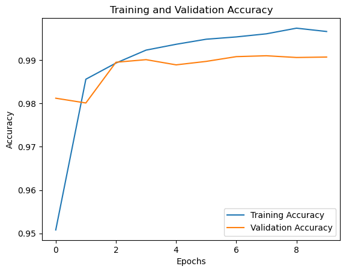

# 🧠 Handwritten Digit Recognition using CNN

This project is a Convolutional Neural Network (CNN) implementation for recognizing handwritten digits from the MNIST dataset. It was built as a part of my deep learning practice to explore image classification using CNNs.

## 📌 Project Overview

- **Objective**: To classify handwritten digits (0–9) using a Convolutional Neural Network.
- **Dataset**: [MNIST](http://yann.lecun.com/exdb/mnist/)
- **Model Type**: CNN (Convolutional Neural Network)
- **Framework**:  Tensorflow / Keras

## 🧰 Tech Stack

- Python 3.11  
- TensorFlow / Keras  
- NumPy  
- Matplotlib  
- Jupyter Notebook

## 📂 Project Structure
```
    DataProject03_CNN_HandwritingRecognition  
    ├── app                           
        └── streamlit_app.py              # Interactive app via Streamlit 
    ├── datasets  
        └── mnist.py                      # Load dataset
    ├── notebooks 
        ├── research_cnn.ipynb            # Research Jypyter Notebook  
        └── research_streamlit.py
    ├── saved_model 
        └── cnn_model.keras               # Saved trained model
    ├── src   
        ├── cnn_recognition.py            # Core CNN architecture
        └── utils.py                      # Helper functions for Streamlit app
    ├── main.py                           # Entry point for running project
    ├── README.md                         # Project documentation
    └── requirements.txt                  # Python dependencies
```


## 🧪 Model Architecture

- **Input Layer**: 28x28 grayscale images
- **Conv2D**: 32 filters, 3x3 kernel, ReLU
- **MaxPooling2D**: 2x2
- **Conv2D**: 64 filters, 3x3 kernel, ReLU
- **MaxPooling2D**: 2x2
- **Flatten**
- **Dense**: 64 units, ReLU
- **Output Layer**: 10 units (softmax)

## 📈 Performance

- **Training Accuracy**: ~99%
- **Validation Accuracy**: ~99%
- **Test Accuracy**: ~99%



## 🚀 How to Run
📦 Clone the repository Clone the repository:

```bash
git clone https://github.com/VanNguyen-Mia/DataProject03_CNN_HandwritingRecognition.git
cd DataProject03_CNN_HandwritingRecognition
```
📥 Install the dependencies:
```
pip install -r requirements.txt
```
▶️ Option 1: Run the main script  
Use this if you want to train or test the model directly from the terminal.

```
python main.py
```
🖼️ Option 2: Run the Streamlit app:

```
streamlit run app/streamlit_app.py
```
📓 Option 3: Explore the notebooks  
You can explore or modify the model and visualizations using Jupyter.  
```
jupyter notebook notebooks/research_cnn.ipynb
```

## ✅ Results
- Confusion matrix showing model performance.

- Visual samples of correct and incorrect predictions.

## 🧠 What I Learned
- How CNNs extract spatial features from images.

- The importance of dropout in reducing overfitting.

- Basic hyperparameter tuning for better model performance.

## 🙌 Acknowledgements
MNIST Dataset

TensorFlow/Keras documentation

Coursera Deep Learning Specialization